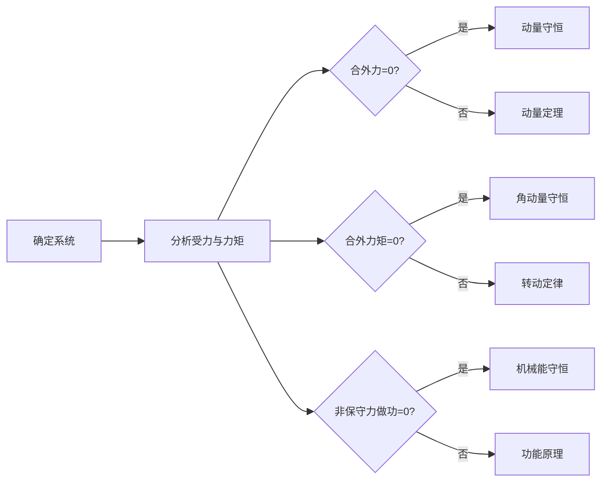

# 第一章 质点运动学
## 一、描述运动的物理量
### 1. 位矢、位移和路程
- **位矢**
  - 定义：由坐标原点到质点位置的矢量 $\boldsymbol{r}$
  - 表达式：$\boldsymbol{r} = x \boldsymbol{i} + y \boldsymbol{j}$
  - 大小：$r = |\boldsymbol{r}| = \sqrt{x^2 + y^2}$
- **运动方程**
  - 矢量形式：$\boldsymbol{r} = \boldsymbol{r}(t)$
  - 分量形式：
    $$\begin{cases}
    x = x(t) \\
    y = y(t)
    \end{cases}$$
- **位移与路程**
  - 位移：$\Delta \boldsymbol{r} = \boldsymbol{r}_B - \boldsymbol{r}_A = \Delta x \boldsymbol{i} + \Delta y \boldsymbol{j}$
  - 大小：$|\Delta \boldsymbol{r}| = \sqrt{\Delta x^2 + \Delta y^2}$
  - 路程：$\Delta s$（轨迹的实际长度，标量）

### 2. 速度
- **平均速度**
  $$\overline{\boldsymbol{v}} = \dfrac{\Delta \boldsymbol{r}}{\Delta t} = \dfrac{\Delta x}{\Delta t} \boldsymbol{i} + \dfrac{\Delta y}{\Delta t} \boldsymbol{j}$$
- **瞬时速度**
  $$\boldsymbol{v} = \dfrac{d\boldsymbol{r}}{dt} = \dfrac{dx}{dt} \boldsymbol{i} + \dfrac{dy}{dt} \boldsymbol{j} = v_x \boldsymbol{i} + v_y \boldsymbol{j}$$
  - 大小：$|\boldsymbol{v}| = \sqrt{v_x^2 + v_y^2}$
  - 速率：$v = \dfrac{ds}{dt}$（速度的大小）

### 3. 加速度
- **平均加速度**
  $$\overline{\boldsymbol{a}} = \dfrac{\Delta \boldsymbol{v}}{\Delta t}$$
- **瞬时加速度**
  $$\boldsymbol{a} = \dfrac{d\boldsymbol{v}}{dt} = \dfrac{d^2\boldsymbol{r}}{dt^2} = a_x \boldsymbol{i} + a_y \boldsymbol{j}$$
  - 大小：$|\boldsymbol{a}| = \sqrt{a_x^2 + a_y^2}$

___
## 二、圆周运动
### 1. 线量与角量对应关系
| 物理量 |                            线量表示                             |              角量表示              |
| :-: | :---------------------------------------------------------: | :----------------------------: |
| 位移  |                         $\Delta s$                          |        $\Delta \theta$         |
| 速度  |                    $v = \dfrac{ds}{dt}$                     | $\omega = \dfrac{d\theta}{dt}$ |
| 加速度 | $a_\tau = \dfrac{dv}{dt}$（切向） $a_n = \dfrac{v^2}{R}$（法向） | $\alpha = \dfrac{d\omega}{dt}$ |

### 2. 匀变速圆周运动公式
- **线量关系**
  $$\begin{cases}
  v = v_0 + a_\tau t \\
  s = v_0 t + \dfrac{1}{2} a_\tau t^2 \\
  v^2 - v_0^2 = 2 a_\tau s
  \end{cases}$$
- **角量关系**
  $$\begin{cases}
  \omega = \omega_0 + \alpha t \\
  \theta = \omega_0 t + \dfrac{1}{2} \alpha t^2 \\
  \omega^2 - \omega_0^2 = 2 \alpha \theta
  \end{cases}$$

___
---
# 第二章 动量与能量守恒

## 一、质点动量定理与守恒
### 1. 基本概念

- **动量**：$\boldsymbol{p} = m\boldsymbol{v}$

- **冲量**：$\boldsymbol{I} = \displaystyle\int_{t_1}^{t_2} \boldsymbol{F} \, dt$

### 2. 动量定理

$\boldsymbol{I} = \Delta \boldsymbol{p} = m\boldsymbol{v}_2 - m\boldsymbol{v}_1$

分量形式：

$$\begin{cases}

I_x = \displaystyle\int F_x \, dt = m(v_{2x} - v_{1x}) \\

I_y = \displaystyle\int F_y \, dt = m(v_{2y} - v_{1y})

\end{cases}$$

### 3. 动量守恒定律

当系统所受合外力为零时：

$\displaystyle\sum \boldsymbol{F}_{\text{ext}} = 0 \quad \Rightarrow \quad \displaystyle\sum m_i \boldsymbol{v}_i = \text{常量}$

---
## 二、动能定理与机械能守恒
### 1. 基本概念

- **动能**：$E_k = \dfrac{1}{2}mv^2$

- **功**：$W = \displaystyle\int \boldsymbol{F} \cdot d\boldsymbol{r}$

### 2. 动能定理

$W_{\text{net}} = \Delta E_k = \dfrac{1}{2}mv_2^2 - \dfrac{1}{2}mv_1^2$

### 3. 机械能守恒条件

若仅有保守力做功：

$W_{\text{非保守力}} = 0 \quad \Rightarrow \quad E = E_k + U = \text{常量}$

___
___
# 第三章 刚体力学
## 一、刚体运动学
### 1. 运动分类
| 运动类型 |    描述    |                                                   速度公式                                                    |
| :--: | :------: | :-------------------------------------------------------------------------------------------------------: |
|  平动  |  各点运动相同  |                              $\boldsymbol{v}_P = \boldsymbol{v}_{\text{cm}}$                              |
| 定轴转动 |  绕固定轴旋转  |                       $\boldsymbol{v} = \boldsymbol{\omega} \times \boldsymbol{r}$                        |
| 平面运动 | 平动与转动的合成 | $\boldsymbol{v}_P = \boldsymbol{v}_{\text{cm}} + \boldsymbol{\omega} \times \boldsymbol{r}_{P/\text{cm}}$ |

___
## 二、转动惯量与转动定律
### 1. 力矩的定义
- **力矩**（$\boldsymbol{M}$）是描述力对物体产生转动效果的物理量，定义为：
  $\boldsymbol{M} = \boldsymbol{r} \times \boldsymbol{F}$
  其中：
  - $\boldsymbol{r}$ 是从转轴到力的作用点的位矢（单位：$\text{m}$）
  - $\boldsymbol{F}$ 是作用力（单位：$\text{N}$）
  - $\boldsymbol{M}$ 是力矩（单位：$\text{N·m}$）
  力矩的方向由右手定则确定：四指从 $\boldsymbol{r}$ 转向 $\boldsymbol{F}$，拇指方向即为力矩方向

### 2. 转动惯量计算方法
- **基本定义**
  - 离散质点系：$J = \displaystyle\sum_{i=1}^n m_i r_i^2$
  - 连续刚体：$J = \displaystyle\int r^2 \, dm$
- **计算技巧**
  - **分解法**：复杂刚体分解为简单几何形状之和，$J_{\text{总}} = J_1 + J_2 + \cdots + J_n$
  - **平行轴定理**：$J = J_{\text{cm}} + Md^2$
  - **垂直轴定理**（薄板）：$J_z = J_x + J_y$
  
|   刚体形状   |              转动惯量公式               |    转动轴描述    |
| :------: | :-------------------------------: | :---------: |
|    细棒    |      $J = \dfrac{ml^2}{12}$       | 转动轴通过中心与棒垂直 |
|   圆柱体    |       $J = \dfrac{mR^2}{2}$       |   转动轴沿几何轴   |
|   薄圆环    |            $J = mR^2$             |   转动轴沿几何轴   |
|    球体    |      $J = \dfrac{2mR^2}{5}$       | 转动轴沿球的任一直径  |
| 圆筒（空心圆柱） | $J = \dfrac{m}{2}(R_1^2 + R_2^2)$ |   转动轴沿几何轴   |
|    细棒    |       $J = \dfrac{ml^2}{3}$       |  转动轴通过棒的一端  |

### 3. 转动定律
- $\displaystyle\sum \boldsymbol{M} = J \boldsymbol{\alpha}$

___
## 三、角动量守恒
### 1. 角动量定义
- $\boldsymbol{L} = J\boldsymbol{\omega} = \boldsymbol{r} \times \boldsymbol{p}$

### 2. 角动量守恒的条件
- 当合外力矩为零时：
  $\displaystyle\sum \boldsymbol{M}_{\text{ext}} = 0 \quad \Rightarrow \quad \boldsymbol{L} = \text{常量}$

___
## 四、角能量
### 1. 角动能定义
- **角动能**（$E_k$）是刚体绕固定轴转动时所具有的动能，定义为：
  $E_k = \dfrac{1}{2} J \omega^2$
  其中：
  - $J$ 是刚体的转动惯量（单位：$\text{kg·m}^2$）
  - $\omega$ 是刚体的角速度（单位：$\text{rad/s}$）
  - $E_k$ 的单位是焦耳（$\text{J}$）
  角动能是刚体转动状态的一种能量表现形式，类似于平动动能 $E_k = \dfrac{1}{2}mv^2$

### 2. 角动能定理
- 角动能定理描述了外力对刚体所做的功与刚体角动能变化的关系：
  $W = \Delta E_k = \dfrac{1}{2} J \omega_2^2 - \dfrac{1}{2} J \omega_1^2$
  其中：
  - $W$ 是外力对刚体所做的功
  - $\omega_1$ 和 $\omega_2$ 分别是刚体的初角速度和末角速度

### 3. 角动能与转动定律的关系
- 结合转动定律 $\displaystyle\sum \boldsymbol{M} = J \boldsymbol{\alpha}$ 和角动能定理，可以得到：
  $W = \displaystyle\int M d\theta = \Delta E_k$
  其中：
  - $W$ 是外力矩对刚体所做的功
  - $M$ 是力矩
  - $\theta$ 是刚体的角位移
  - $\Delta E_k$ 是角动能的变化量

### 4. 角能量守恒
- 当系统不受外力矩作用时（$\displaystyle\sum \boldsymbol{M}_{\text{ext}} = 0$），系统的总角能量守恒：
  $E_k = \dfrac{1}{2} J \omega^2 = \text{常量}$
  此时，系统的角动能不会因内部作用而改变

___
## 五、守恒定律的选择

____
---
# 第四章、狭义相对论
## 一、基本假设
### 1. 相对性原理
- **所有惯性参考系中，物理定律具有相同形式**
  - 不存在"绝对静止"的参考系
  - 物理规律与惯性系的运动状态无关

### 2. 光速不变原理
- **真空中的光速$c$在所有惯性系中相同**
  - 与光源和观察者的运动状态无关
  - $c \approx 3 \times 10^8 \text{m/s}$

___
## 二、洛伦兹变换
### 1. 坐标变换公式
- **正变换**($S\rightarrow S'$)
  $$\begin{cases}
  x' = \gamma(x - vt) \\
  y' = y \\
  z' = z \\
  t' = \gamma\left(t - \dfrac{vx}{c^2}\right)
  \end{cases}$$
- **逆变换**($S'\rightarrow S$)
  $$\begin{cases}
  x = \gamma(x'+vt) \\
  y = y' \\
  z = z' \\
  t = \gamma(t'+\dfrac{vx'}{c^2})
  \end{cases}$$
- **洛伦兹因子**
  $$\gamma = \dfrac{1}{\sqrt{1-\dfrac{v^2}{c^2}}}=\dfrac1{\sqrt{1-\beta^2}} \quad (\gamma \geq 1)$$

### 2. 矩阵形式
- **正变换矩阵**
  $$\begin{pmatrix}
  ct' \\ x' \\ y' \\ z' \\
  \end{pmatrix} =
  \begin{pmatrix}
  \gamma & -\gamma\beta & 0 & 0 \\
  -\gamma\beta & \gamma & 0 & 0 \\
  0 & 0 & 1 & 0 \\
  0 & 0 & 0 & 1\\
  \end{pmatrix}
  \begin{pmatrix}
  ct \\ x \\ y \\ z \\
  \end{pmatrix}$$
- **逆变换矩阵**
  $$\begin{pmatrix}
  ct \\ x \\ y \\ z \\
  \end{pmatrix} = 
  \begin{pmatrix}
  \gamma & \gamma\beta & 0 & 0 \\
  \gamma\beta & \gamma & 0 & 0 \\
  0 & 0 & 1 & 0 \\
  0 & 0 & 0 & 1 \\
  \end{pmatrix}
  \begin{pmatrix}
  ct' \\ x' \\ y' \\ z' \\
  \end{pmatrix}$$

### 3. 广义洛伦兹变换
$$\begin{align}
ct' &= \gamma \left( ct - \dfrac{\boldsymbol{\beta} \cdot \boldsymbol{r}}{c} \right) \\
\boldsymbol{r}\,' &= \boldsymbol{r} + \boldsymbol{\beta} \left( \dfrac{\gamma - 1}{\beta^2} (\boldsymbol{\beta} \cdot \boldsymbol{r}) - \gamma ct \right)
\end{align} 
\quad\quad\boxed{\boldsymbol{\beta}=\dfrac {\boldsymbol{v}} c}$$

### 4. 速度变换
$$u_x' = \dfrac{u_x - v}{1 - \dfrac{u_x v}{c^2}}, \quad u_y' = \dfrac{u_y}{\gamma\left(1 - \dfrac{u_x v}{c^2}\right)}, \quad u_z=\dfrac{u_z}{\gamma\left(1- \dfrac{u_x v}{c^2}\right)}$$

___
## 三、相对论效应
### 1. 时间膨胀（钟慢效应）
- $\Delta t = \gamma \Delta t_0$
  - $\Delta t_0$：固有时（本征时间）
  - $\Delta t$：运动观测时间

### 2. 长度收缩
- $L = \dfrac{L_0}{\gamma}$
  - $L_0$：固有长度（静止长度）
  - $L$：运动观测长度

### 3. 同时性的相对性
- 不同惯性系对"同时事件"的判断可能不同
- 时序关系取决于$\dfrac{v\Delta x}{c^2}$

___
## 四、相对论动力学

### 1. 质速关系
- $m = \gamma m_0 = \dfrac{m_0}{\sqrt{1-\dfrac{v^2}{c^2}}}$
  - $m_0$：静质量
  - $m$：动质量

### 2. 动量-能量关系
| 物理量  |                      公式                      |
| :--: | :------------------------------------------: |
|  动量  | $\boldsymbol{p} = \gamma m_0 \boldsymbol{v}$ |
|  总能  |             $E = \gamma m_0 c^2$             |
|  静能  |               $E_0 = m_0 c^2$                |
|  动能  |         $E_k = (\gamma - 1)m_0 c^2$          |
| 总能关系 |          $E^2 = p^2c^2 + m_0^2c^4$           |

### 3. 四维形式
- **四维位移**
  $$X^\mu = (ct, x, y, z)$$
- **四维动量**
  $$P^\mu = \left(\dfrac{E}{c}, p_x, p_y, p_z\right)$$

___
___
# 第五章 热力学
## 一、平衡态与物态方程
### 1. 平衡态定义
- 系统各部分 **压强相等**、**温度相同**，物态参量（$p, V, T$）确定，与外界无能量/物质交换
- **近似平衡态**：状态变化微小可忽略时视为平衡态

### 2. 理想气体的物态方程
- **微观形式**
  $pV = NkT$
  - $N$：分子数；$k = 1.38 \times 10^{-23} \, \text{J·K}^{-1}$（玻耳兹曼常量）
- **宏观形式**
  $pV = \nu RT$
  - $\nu$：物质的量；$R = 8.314 \, \text{J·mol}^{-1}·\text{K}^{-1}$
- **分子数密度形式**
  $p = nkT$
  - $n = N/V$：分子数密度

### 3. 热力学第零定律
- 若两系统分别与第三系统热平衡，则它们彼此热平衡
- **温度**是热平衡的判据

___
## 二、理想气体的压强公式
### 1. 理想气体的微观模型
从气体动理论观点看，理想气体微观模型为：
- 分子本身大小可忽略（可视为质点）
- 除碰撞瞬间外，分子间相互作用力忽略（碰撞间作匀速直线运动）
- 分子间及分子与器壁碰撞为完全弹性碰撞（动能不损失）

### 2. 压强公式推导
设长方体容器尺寸为$x×y×z$，内含$N$个分子，单个分子质量$m$
#### (1) 单个分子对器壁作用
- 分子与$A_1$面碰撞时，动量变化：$Δp_x = -2mv_x$
- 相邻两次碰撞时间间隔：$Δt = \dfrac{2x}{v_x}$
- 单分子对$A_1$面平均作用力：$F_x = 2mv_x · \dfrac{v_x}{2x} = \dfrac{mv_x^2}{x}$

#### (2) 所有分子对器壁作用
- $N$个分子对$A_1$面总作用力：
$$F = \displaystyle\sum_{i=1}^N \dfrac{mv_{ix}^2}{x} = \dfrac{m}{x} \displaystyle\sum_{i=1}^N v_{ix}^2$$

#### (3) 压强表达式
$$p = \dfrac{F}{yz} = \dfrac{m}{xyz} \displaystyle\sum_{i=1}^N v_{ix}^2 = \dfrac{Nm}{V} · \dfrac{\displaystyle\sum v_{ix}^2}{N}$$
其中分子数密度$n = N/V$，$x$方向速度平方平均值：
$$\overline{v_x^2} = \dfrac{\displaystyle\sum_{i=1}^N v_{ix}^2}{N}$$

#### (4) 统计规律应用
- 气体平衡态具有各向同性：
$$\overline{v_x^2} = \overline{v_y^2} = \overline{v_z^2} = \dfrac{1}{3}\overline{v^2}$$
- 分子平均平动动能：
$$\overline{\varepsilon_k} = \dfrac{1}{2}m\overline{v^2}$$

### 3. 理想气体压强公式
$$p = \dfrac{1}{3}nm\overline{v^2} = \dfrac{2}{3}n\overline{\varepsilon_k} = \dfrac{1}{3}\rho\overline{v^2}$$
其中：
- $n$：分子数密度（$m^{-3}$）
- $\overline{\varepsilon_k}$：分子平均平动动能（J）
- $\rho = nm$：气体密度（kg/$m^3$）

### 4. 此过程可得到的其他结论
$$
\begin{gathered}
\because p= \dfrac{3}{2}n\left( \dfrac{1}{2} m\overline{v^2} \right)\quad\quad p=nkT \\
\therefore \varepsilon_{k} = \dfrac{1}{2}m\overline{v^{2}}= \dfrac{3}{2}kT \\
\end{gathered}
$$

___
## 三、分子自由度与热容
### 1. 能量均分原理
- 气体处于平衡态时，分子在任何一个方向的运动都不比其他方向占有优势，分子在各个方向运动的概率是相等的

### 2. 不同分子自由度与热容
|      分子类型      | 自由度 $i$ |          组成（平动+转动+振动）           |    $C_{V,m}$    |    $C_{p,m}$     | $\gamma = \dfrac{C_{p,m}}{C_{V,m}}$ |
| :------------: | :-----: | :-----------------------------: | :-------------: | :--------------: | :---------------------------------: |
|  单原子分子（如 He）   |   $3$   |             $3+0+0$             | $\dfrac{3}{2}R$ | $\dfrac{5}{2}R$  |     $\dfrac{5}{3} \approx 1.67$     |
| 刚性双原子分子（如 O₂）  |   $5$   |             $3+2+0$             | $\dfrac{5}{2}R$ | $\dfrac{7}{2}R$  |        $\dfrac{7}{5} = 1.40$        |
|    非刚性双原子分子    |   $7$   |             $3+2+2$             | $\dfrac{7}{2}R$ | $\dfrac{9}{2}R$  |     $\dfrac{9}{7} \approx 1.29$     |
| 刚性多原子分子（如 CO₂） |   $6$   |             $3+3+0$             |      $3R$       |       $4R$       |     $\dfrac{4}{3} \approx 1.33$     |
| 非刚性多$(n)$原子分子  |  $3n$   | 线性：$3+2+3n-5$ 非线性：$3+3+3n-6$ | $\dfrac{3n}2R$  | $\dfrac{3n+2}2R$ |         $\dfrac{3n+2}{3n}$          |

### 3. 热容公式
- **摩尔定容热容**：$C_{V,m} = \dfrac{i}{2}R$
- **摩尔定压热容**：$C_{p,m} = C_{V,m} + R$
- **热容比**：$\gamma = 1 + \dfrac{2}{i}$

___
## 四、麦克斯韦速率分布
### 1. 速率分布函数
$$\begin{gathered}
f(v)=\lim_{ \Delta x \to \infty } \dfrac{\Delta N}{N\Delta v}=\dfrac{1}{n}\lim_{ n \to \infty } \dfrac{{\Delta N}}{\Delta v} \\
则\quad\quad \dfrac{{dN}}{N}=f(v)dv \\
\\
麦克斯韦速率分布函数:\quad
f(v) = 4\pi \left( \dfrac{m}{2\pi kT} \right)^{3/2} v^2 e^{-\dfrac{mv^2}{2kT}}
\end{gathered}$$

### 2. 三种速率
- **最概然速率**：$v_p = \sqrt{\dfrac{2kT}{m}}$
- **平均速率**：$\overline{v} = \sqrt{\dfrac{8kT}{\pi m}}$
- **方均根速率**：$v_{\text{rms}} = \sqrt{\dfrac{3kT}{m}}$

### 3. $p-V$图特性
- **等温线**：双曲线 $pV =$常量
- **绝热线**：$pV^\gamma =$常量（比等温线陡峭）

___
## 五、玻尔兹曼能量分布律与等温气压公式
### 1. 玻尔兹曼能量分布律
$$
\begin{gathered}
dN=N\left( \frac{m}{2\pi kT} \right)^{\dfrac3 2}e^{-\dfrac{\varepsilon_{k}}{kT}}4\pi v^{2dv} \\
n = n_{0}e^{-\dfrac{\varepsilon_{p}}{kT}}= n_{0}e^{-\dfrac{mgz}{kT}}
\end{gathered}
$$

### 2. 重力场中的等温气压公式
$$
\begin{gathered}
p = p_{0}~e^{-\dfrac{\varepsilon_{p}}{kT}} = p_{0}~e^{-\dfrac{mgz}{kT}} \\
z = \dfrac{{kT}}{mg}\ln {\dfrac{p_{0}}{p}} = \dfrac{{RT}}{Mg}\ln \dfrac{{p_{0}}}{p}
\end{gathered}
$$

___
___
## 六、分子的平均碰撞频率与平均自由程
### 1. 基本概念与定义
- **平均碰撞频率 $\overline{Z}$**：单位时间内分子与其他分子碰撞的平均次数
- **平均自由程 $\overline{\lambda}$**：分子连续两次碰撞间通过路程的平均值
- **核心关系**：
$$\overline{\lambda} = \dfrac{\overline{v}}{\overline{Z}}$$
  其中 $\overline{v}$ 为分子平均速率
- **物理意义**：
  - 分子碰撞实现动量、动能交换，驱动气体从非平衡态向平衡态过渡
  - 碰撞使温度均匀化（如容器内温度差异通过碰撞消除）

### 2. 平均碰撞频率推导
#### (1) 简化模型假设
- 选定分子$\alpha$以平均速率$\overline{v}$运动，其余分子静止
- 分子视为直径$d$的弹性小球（碰撞完全弹性）
- 运动轨迹为折线，碰撞发生在球心距$≤d$时

#### (2) 碰撞圆柱体模型
- 以分子$\alpha$轨迹为轴，$d$为半径作圆柱体
- 圆柱体体积：$V = \pi d^{2}\overline{v}$
- 球心在圆柱体内的分子均与$\alpha$碰撞

#### (3) 初始公式与修正
- **未修正公式**（仅分子$\alpha$运动）：
$$\overline{Z} = \pi d^{2}\overline{v}n$$
  其中$n$为分子数密度，$\pi d^2$称碰撞截面
- **实际修正**（考虑所有分子运动）：
$$\overline{Z} = \sqrt{2}\pi d^{2}\overline{v}n$$
  - 修正因子$\sqrt{2}$源于分子速率的麦克斯韦分布
- **影响因素**：
  - $\overline{Z} \propto n$（分子数密度）
  - $\overline{Z} \propto \overline{v}$（分子平均速率）
  - $\overline{Z} \propto d^2$（分子有效直径平方）

### 3. 平均自由程公式
#### (1) 基本表达式
$$\overline{\lambda} = \dfrac{1}{\sqrt{2}\pi d^{2}n}$$

#### (2) 压强与温度形式
- 由$p = nkT$得：
$$\overline{\lambda} = \dfrac{kT}{\sqrt{2}\pi d^{2}p}$$
- **物理含义**：
  - 温度$T$一定时：$p \uparrow \Rightarrow \overline{\lambda} \downarrow$（气体密集则自由程短）
  - 压强$p$一定时：$T \uparrow \Rightarrow \overline{\lambda} \uparrow$（温度升高使碰撞间距增大）
- **与速率无关性**：$\overline{\lambda}$独立于$\overline{v}$，仅取决于$d,n,T,p$

### 4. 有效直径与数量级
#### (1) 模型近似性说明
- 分子非理想球体，碰撞非完全弹性
- $d$为**有效直径**：综合反映分子相互作用

#### (2) 典型数值
- **标准状态下**：
  - $\overline{Z} \sim 10^{9}\, \text{s}^{-1}$（每秒约十亿次碰撞）
  - $\overline{\lambda} \sim 10^{-8}-10^{-7}\, \text{m}$
- **碰撞频繁性**：高频碰撞导致平均自由程极短

___
## 七、热力学第一定律及应用
### 1. 热力学第一定律
$$\Delta U = Q - W$$

### 2. 四种典型过程
- 原理
$$\Delta E = \Delta U = \nu C\Delta T$$

| 过程  |           条件            |                   功 $W$                   |            热量 $Q$            |   内能变化 $\Delta U$    |
| :-: | :---------------------: | :---------------------------------------: | :--------------------------: | :------------------: |
| 等容  |      $\Delta V=0$       |                    $0$                    | $Q_V = \nu C_{V,m} \Delta T$ |   $\Delta U = Q_V$   |
| 等压  |         $p =$常量         |                $p\Delta V$                | $Q_p = \nu C_{p,m} \Delta T$ | $\Delta U = Q_p - W$ |
| 等温  |   $T =$常量 $PV=$常量    |       $\nu RT \ln\dfrac{V_2}{V_1}$        |          $Q_T = W$           |    $\Delta U = 0$    |
| 绝热  | $Q=0$ $PV^\gamma=$常量 | $W = \dfrac{p_1V_1 - p_2V_2}{\gamma - 1}$ |             $0$              |   $\Delta U = -W$    |

___
## 八、热机效率与制冷系数
### 1. 热机效率
- **热机效率公式**：
$$\eta = \dfrac{W}{Q_{1}}= \dfrac{{Q_{1}-|Q_{2}|}}{Q_{1}} = 1 - \dfrac{|Q_2|}{Q_1}$$
  - $Q_1$：吸热量；$Q_2$：放热量（取绝对值）
- **卡诺热机（两等温两绝热）效率**：
$$\eta_{\text{卡诺}} = 1 - \dfrac{T_2}{T_1}$$
  - $T_1$：高温热源温度（K）；$T_2$：低温热源温度（K）

### 2. 制冷系数
- **制冷系数公式**：
$$e=\dfrac{{Q_{2}}}{|W|}=\dfrac{{Q_{2}}}{|Q_{1}|-Q_{2}}$$
  - $Q_1$：吸热量（取绝对值）；$Q_2$：放热量
- 卡诺制冷机制冷系数
$$e_{卡诺} = {\frac{Q_{2}}{|Q_{1}|-Q_{2}}} = {\frac{T_{2}}{T_{1}-T_{2}}}$$
  - $T_1$：高温热源温度（K）；$T_2$：低温热源温度（K）

___
## 九、热力学第二定律与卡诺定理
### 1. 热力学第二定律
- **开尔文表述**：无法从单一热源吸热全部转化为功而不产生其他影响
- **克劳修斯表述**：热量不能自发从低温传至高温

### 2. 卡诺定理
**卡诺定理基本结论**
在温度为$T_1$的高温热源和温度为$T_2$的低温热源之间工作的热机，必须满足：
- **(1)** 相同热源间的任意可逆机效率相同
- **(2)** 任何不可逆机效率均不大于可逆机效率

#### (1) 可逆机效率公式
以理想气体为工作物质的卡诺热机满足：
$$\eta = 1 - \frac{|Q_2|}{Q_1} = 1 - \frac{T_2}{T_1}$$
- $Q_1$：高温热源吸热量
- $Q_2$：低温热源放热量（取绝对值）
- $T_1$：高温热源温度（K）
- $T_2$：低温热源温度（K）

#### (2) 不可逆机效率关系
不可逆机效率$\eta'$满足：
$$\eta' \leqslant 1 - \frac{T_2}{T_1}$$
- **$=$**：适用于可逆机
- **$<$**：适用于不可逆机

___
## 十、熵与统计解释
### 1. 熵的定义
- $\Delta S = \displaystyle\int \dfrac{dQ_{\text{rev}}}{T}$
- **熵增加原理**：孤立系统中，$\Delta S \geq 0$（不可逆过程熵增加）

### 2. 玻耳兹曼熵公式
- $S = k \ln W$
  - $W$：热力学概率（微观状态数）

___
___
# 第六章、静电场
## 一、电荷守恒定律
### 1. 电荷的量子化
- 元电荷：电子电荷的绝对值$e$被称为元电荷，单位为库伦，简称库，符号为$C$
$$e~=~1.602\times 10^{-19}~~C$$
### 2. 电荷守恒定律
- 不管系统中的电荷如何转移，系统中电荷的代数和保持不变，这就是电荷守恒定律。
### 3. 库伦定律
- 库伦定义的表述：
		在真空中，两个静止的点电荷之间的相互作用力，其大小与它们电荷乘积成正比，与它们之间距离的二次方成反比；作用力的方向沿着两点电荷的连线，同号电荷相斥，异号电荷相吸。
- 公式表述
$$\boldsymbol{F}~=~\dfrac{1}{4\pi \varepsilon_0}~\dfrac{q_1q_2}{r^2}~\boldsymbol{e_r}$$
$$
\begin{align}
\text{其中}~~~
\varepsilon_0~ &=8.85\times10^{-12}~~ C^2\cdot N^{-1}\cdot m^{-2} \\
				&=8.85\times10^{-12}~~ F\cdot m^{-1}
\end{align}
$$

___
## 二、电场强度
### 1. 电场强度
$$
\begin{align}
&\text{定义：}\boldsymbol{E}~=\dfrac{\boldsymbol{F}}{q_0}，\text{表明电场中某点处的电场强度}\mathbf{E}\text{等于位于该点处单位试验电}\\
&{荷所受的电场力。}
\end{align}
$$
反之，则有$\mathbf{F}~=~q\mathbf{E}$ 
### 2. 点电荷的电场强度
$$E~=~\dfrac{\boldsymbol{F}}{q_0}~ = \dfrac{1}{4\pi \varepsilon_0}~\dfrac{Q}{r^2}~\boldsymbol{e_r},\text{其中Q为中心点电荷大小，}q_0\text{为试验电荷大小}$$
### 3. 电场强度叠加原理
- 遵循矢量加减原则

___
# 三、高斯定理
## 1. 电场强度通量
- 定义：我们把通过这个电场中某一个面的电场线数目，叫做通过这个面的电场强度通量，用符号$\varPhi_e$表示。
- $$\varPhi_e~=~ES\cos\theta$$
### 2. 高斯定理
$$\varPhi_e~ = \oint_S\boldsymbol{E}\cdot d\boldsymbol{S}~=\dfrac{q}{\varepsilon_0}~~~\text{其中}q\text{为}S\text{面所围区域的电荷量}$$
推导：
$$
\begin{align}
&\because~ E = \dfrac{1}{4\pi \varepsilon_0}~\dfrac{q}{R^2},d\varPhi_e = \boldsymbol{E}\cdot d\boldsymbol{S} = E~dS~\cos\theta = \dfrac{q}{4\pi \varepsilon_0}~\dfrac{dS~\cos\theta}{r^2} = \dfrac{q}{4\pi \varepsilon_0}~\dfrac{dS'}{r^2}\\
&记d\varOmega = \dfrac{dS\cos\theta}{r^2},即d\varPhi = \dfrac{q}{4\pi \varepsilon_0}~d\varOmega  \\
&\therefore \varPhi_e = \oint_S d\varPhi_e = \oint_s\boldsymbol{E}\cdot d\boldsymbol{S} = \dfrac{q}{4\pi \epsilon_0}\oint_S d\varOmega  \\
&而\oint_Sd\varOmega = 4\pi  \\
&\therefore \varPhi_e~ = \oint_S\boldsymbol{E}\cdot d\boldsymbol{S}~=\dfrac{q}{\varepsilon_0}
\end{align}
$$

___
## 四、电势能
### 1. 静电场力所做的功
- $W = q_0 \displaystyle\int \boldsymbol{E}~d\boldsymbol{l}$
$$对于点电荷的直线运动（A\rightarrow B），则为W=\dfrac{q~q_0}{4\pi\varepsilon_0}(\dfrac{1}{r_A}-\dfrac{1}{r_B})$$
### 2. 静电场的环路定理
$$q_0\oint_l\boldsymbol{E}~d\boldsymbol{l} = 0$$
___
## 五、电势
### 1. 电势
$$V=\dfrac{E_p}{q_0}~~~ 其中E_p为电势能$$
### 2. 点电荷电场的电势
$$V = \displaystyle\int_r^\infty\boldsymbol{E}~d\boldsymbol{l} = \dfrac{q}{4\pi \varepsilon_0}~\dfrac{1}{r}$$

___
## 六、电场强度与电势梯度
### 1. 等势面
- 电场中电势相等的点所构成的面，叫做等势面
### 2. 电场强度和电势梯度
- 电场中某一点的电场强度沿任一方向的分量，等于这一点的电势沿该方向的电势变化率的负值。
$$
\begin{align}
&即~~~ E_n =-\dfrac{dV}{dl_n} \text{（标量式）}~ \leftrightarrow~\boldsymbol{E} = -\dfrac{dV}{dl_n} \boldsymbol{e}_n \text{（矢量式）}    \\
&矢量表达式为~~\boldsymbol{E} = -(\dfrac{\partial V}{\partial x}\boldsymbol{i}+\dfrac{\partial V}{\partial y} \boldsymbol{j}+\dfrac{\partial V}{\partial z}\boldsymbol{k})  \\
&梯度表达为~~ \boldsymbol{E} = - grad{V} = -~\mathbf{\nabla}V
\end{align}
$$

___
## 七、静电场中的导体
### 1. 静电平衡条件
- (1) 导体内部任何一点出的电场强度为零
- (2)导体表面处电场的方向都与导体表面垂直（即$U=\displaystyle\int_{AB}\boldsymbol{E}\cdot d\boldsymbol{l}=0$）
### 2. 静电平衡时导体上的电荷分布
#### (1) 导体内
$$由于导体内有~\boldsymbol{E} = 0，则~\varPhi_e=\oint_S\boldsymbol{E}\cdot d\boldsymbol{S} = 0 = \dfrac{q}{\varepsilon_0}$$
- 即静电平衡时，导体所带的电荷只能分布在导体的表面上，导体内没有净电荷。
#### (2) 导体表面
$$
\begin{gathered}
\text{记电荷面密度为 } \sigma\text{，则 } \Delta q = \sigma \Delta S \\
\oint_{S} \boldsymbol{E}\cdot d\boldsymbol{S} = E \Delta S = \dfrac{\sigma \Delta S}{\varepsilon_{0}} \\
\text{则 } E = \dfrac{\sigma}{\varepsilon_{0}}
\end{gathered}
$$
#### (3) 静电屏蔽
- 在静电场中，因导体的存在使某些特定的区域不受电场影响的现象称为静电屏蔽
- 空腔导体（无论接地与否）将使空腔内空间不受外电场的影响；而接地空腔导体将使外部空间不受空腔内电场的影响。这就是空腔导体的静电屏蔽作用。
### 3. 静电场中的电介质
#### (1) 相对电容率
$$E=\dfrac{E_{0}}{\varepsilon_r}$$
式中$\varepsilon_r$叫做电介质的相对电容率。相对电导率$\varepsilon_r$与真空电导率$\varepsilon_0$的乘积$\varepsilon~=~\varepsilon_0\varepsilon_r$叫做电容率。
#### (2) 电偶极子
- 电偶极矩：$\boldsymbol{p}=q\boldsymbol{r}_0$
- 力矩：$\boldsymbol{M} = \boldsymbol{p} \times \boldsymbol{E}$
- 平衡时，有 $E_p = -\boldsymbol{p}\cdot\boldsymbol{E}$
#### (3) 电极化强度
$$\boldsymbol{P} = \dfrac{\displaystyle\sum\boldsymbol{p}}{\Delta V} \quad\quad式中\boldsymbol{P}叫做{\color{blue}电极化强度}，它的单位是C\cdot m^{-2} $$
特殊地，对于量平行板的间电介质的电极化强度的大小，与电介质表面极化电荷面密度的大小相等。
$$\boldsymbol{P} = \dfrac{\displaystyle\sum \boldsymbol{p}}{\Delta V}=\dfrac{\sigma'\Delta Sl}{\Delta Sl} = \sigma'$$
#### (4) 极化电荷与自由电荷的关系
- 电场强度关系
$$\boldsymbol{E=E}_0+\boldsymbol{E}'\quad\quad 其中，E为叠加电场，E_0为外电场，E'为极化电场$$
- 电极化强度关系
$$\boldsymbol{P} = (\varepsilon_r-1)\varepsilon_0\boldsymbol{E}=\chi_e\varepsilon_0\boldsymbol{E}\quad\quad式中\chi_e=\varepsilon_r-1称为电介质的\color{blue}电极化率$$
$$\color{red}在高频条件下，电介质的相对电容率\varepsilon_r和外电场的频率f是有关的。$$
### 4. 电位移（有电介质时的高斯定理）
$$
\begin{gathered}
\oint_S\boldsymbol{E}~d\boldsymbol{S}=\dfrac{Q}{\varepsilon_0\varepsilon_r}   \\
令\boldsymbol{D} = \varepsilon_0\varepsilon_r\boldsymbol{E}=\varepsilon\boldsymbol{E}\quad式中\boldsymbol{D}称为电位移，单位为C\cdot m^{-2}.   \\
而\quad\boldsymbol{P} = (\varepsilon_r-1)\varepsilon_o\boldsymbol{E}  \\
\therefore \boldsymbol{D}=\boldsymbol{P}+\varepsilon_0\boldsymbol{E} \\
则有\quad\oint_S\boldsymbol{D}~d\boldsymbol{S} = Q   \\
\end{gathered}
$$
### 5. 电容 电容器
$$
\begin{gathered}
C=\dfrac Q V \\
对于球形电容器（半径为R）&C=4\pi\varepsilon_0R \\
对于平行金属板电容器（两板间距离为d，面积为S）\quad &C=\dfrac{Qd}{S} \\
&=\dfrac{\varepsilon_0\varepsilon_rS}{d}
\end{gathered}
$$
- 电容器的并联
$$C=\displaystyle\sum C_i$$
- 电容器的串联
$$\dfrac 1 C = \displaystyle\sum\dfrac 1 {C_i}$$
### 6. 静电场的能量
#### (1) 电容器的电能
$$电容器的能量为\quad W_e=\dfrac{Q^2}{2C}=\dfrac 1 2 QU=\dfrac 1 2CU^2$$
#### (2) 静电场的能量
$$W_e=\dfrac C{U^2}=\dfrac1 2\dfrac{\varepsilon S}{d}(Ed)^2=\dfrac1 2\varepsilon E^2Sd$$
#### (3) 电场的能量密度
$$\omega_e=\dfrac1 2\varepsilon E^2=\dfrac{1}{2}ED$$
